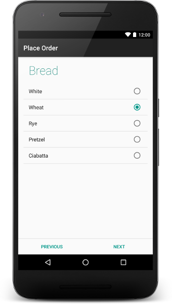
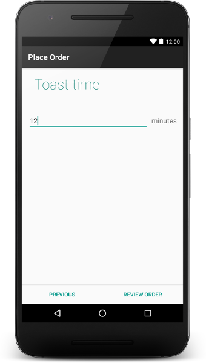

# wizard-pager
  

Wizard Pager is an extendable library that provides a Wizard UI on Android. It's based on the idea of Roman Nurik (https://github.com/romannurik/android-wizardpager)

It is backwards compatible with Android 4.1 (as of 1. September 2016, 96,6 % of Android Devices use Android 4.1 or above)

## Download

WizardPager is ready to be used via [jcenter](https://bintray.com/davidhamm/maven/wizard-pager)
Simply add jcenter to your repositories by adding the following code to your root 'build.gradle':

```groovy
allprojects {
	repositories {
		jcenter()
		...
	}
}
```

Now add the gradle dependency in your application's 'build.gradle':

```groovy
dependencies {
	compile 'com.hammwerk:wizardpager:1.3.0'
}
```

## Usage

There is a sample implementation, so you can see how to add this library to your project. The example uses AppCompat.